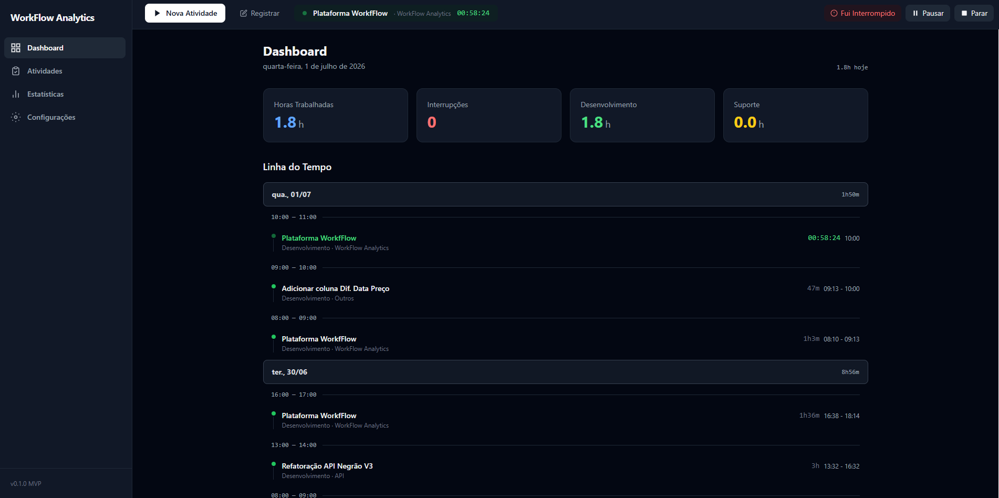
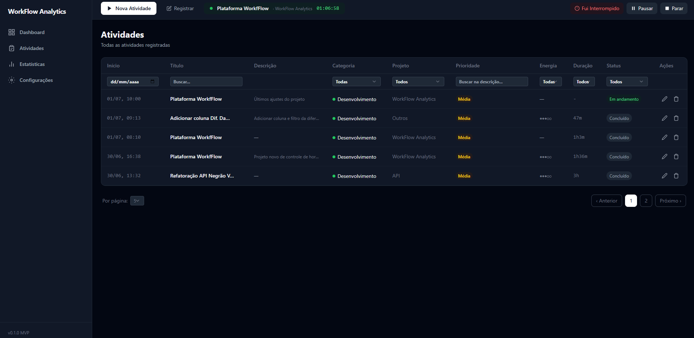
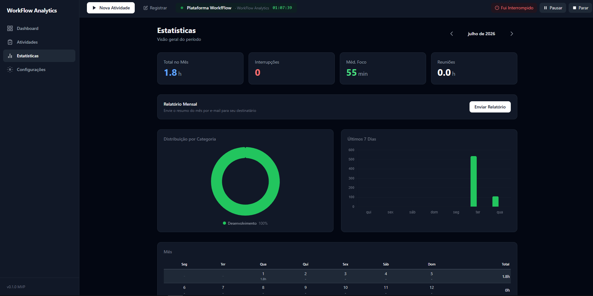

# WorkFlow Analytics

<p align="center">
  
  
  
  
  
  
</p>

**WorkFlow Analytics** é uma aplicação web single-user para registro de horas, análise de produtividade e geração de relatórios. Imagine um "toggl" com dashboards e relatórios mensais prontos para enviar ao seu gestor.

Você cronometra suas atividades em tempo real, classifica por categoria (desenvolvimento, suporte, reunião), registra interrupções, e no fim do mês gera um relatório completo com gráficos e CSV — tudo enviado por e-mail com um template customizável.

> Construído com **Laravel 13**, **Vue 3** e **Inertia.js** — monólito moderno sem a complexidade de um SPA separado.

## Funcionalidades

- **Timer em tempo real** — inicia, pausa, retoma e finaliza atividades com durações calculadas automaticamente
- **Controle de interrupções** — registre pausas (chamadas, reuniões não planejadas, e-mails) vinculadas à atividade principal
- **Registro manual** — cadastre atividades passadas com horário de início e fim personalizados
- **Dashboard** — visão geral do dia com horas totais, interrupções, horas por categoria e timeline dos últimos 3 dias
- **Lista de atividades** — tabela completa com busca, filtros por data/categoria/projeto/prioridade/nível de energia e paginação
- **Estatísticas mensais** — gráficos (Chart.js) de distribuição por categoria, barras dos últimos 7 dias, resumo semanal, calendário diário e top 5 atividades
- **Relatório por e-mail** — envia um HTML formatado com CSV anexo para o e-mail configurado, usando template customizável com placeholders
- **Configurações de SMTP** — configure servidor de e-mail diretamente pela interface (host, porta, usuário, senha, criptografia)
- **Palette de comandos** — `Ctrl+K` / `Cmd+K` para navegação e ações rápidas
- **Autenticação completa** — registro, login, reset de senha (via Laravel Breeze)

## Telas do Sistema

### Dashboard



Visão geral do seu dia. Quatro cards mostram horas trabalhadas, interrupções, horas de desenvolvimento e suporte. Abaixo, uma timeline agrupa as atividades dos últimos 3 dias por hora, com indicador visual de atividade em andamento (pulso verde). A página atualiza automaticamente a cada 30 segundos e o timer ao vivo é atualizado a cada 1 segundo.

### Atividades



Tabela completa com todas as atividades registradas. Filtros por data, título, descrição, categoria, projeto, prioridade (baixa/média/alta/crítica), nível de energia (1 a 5) e status (em andamento/pausado/concluído). Cada linha mostra cor da categoria, prioridade e nível de energia com indicadores visuais. Paginação com 5, 10, 20, 50 ou 100 itens por página. Ícones para editar ou excluir.

### Estatísticas



Análise mensal com navegação entre meses. Cards de resumo (total de horas, interrupções, média de foco, horas em reunião) e:

- **Gráfico doughnut** — distribuição das horas por categoria (desenvolvimento, suporte, reunião, etc.)
- **Gráfico de barras** — desenvolvimento vs. suporte nos últimos 7 dias (empilhado)
- **Calendário mensal** — dia a dia com horas trabalhadas
- **Resumo semanal** — horas e interrupções por semana
- **Top 5 atividades** — ranking das mais longas no mês

Botão **"Enviar Relatório"** envia tudo por e-mail para o destinatário configurado.

### Configurações

Configuração de SMTP, destinatário e template do relatório mensal. Detalhes na seção abaixo.

## Tecnologias

| Tecnologia | Versão | Para que serve |
|---|---|---|
| [PHP](https://php.net) | ^8.3 | Linguagem principal do backend |
| [Laravel](https://laravel.com) | ^13.8 | Framework PHP — rotas, ORM, filas, mail, migrations |
| [Vue 3](https://vuejs.org) | ^3.4 | Framework frontend reativo |
| [Inertia.js](https://inertiajs.com) | ^2.0 | Ponte entre Laravel e Vue — sem API REST, sem SPA separado |
| [Vite](https://vitejs.dev) | ^8.0 | Bundler e dev server com HMR |
| [Tailwind CSS](https://tailwindcss.com) | ^3.2 | Estilização utilitária |
| [Chart.js](https://chartjs.org) | ^4.5 | Gráficos no dashboard de estatísticas |
| [vue-chartjs](https://vue-chartjs.org) | ^5.3 | Adaptador Vue para Chart.js |
| [Laravel Breeze](https://laravel.com/docs/starter-kits) | ^2.4 | Scaffold de autenticação (Inertia stack) |
| [SQLite](https://sqlite.org) | — | Banco de dados padrão (sem instalação extra) |
| [Docker](https://docker.com) | — | Ambiente de desenvolvimento conteinerizado |

## Pré-requisitos

- **PHP** 8.3 ou superior com extensões: `bcmath`, `ctype`, `fileinfo`, `json`, `mbstring`, `openssl`, `pdo`, `pdo_sqlite`, `tokenizer`, `xml`
- **Composer** (gerenciador de dependências PHP)
- **Node.js** 22+ e **npm**
- **Docker** e **Docker Compose** (apenas se quiser usar o ambiente conteinerizado)

## Setup

Você pode subir o projeto de duas formas: manual (recomendado para desenvolvimento) ou com Docker.

### Setup rápido (manual)

O comando abaixo executa tudo de uma vez:

```bash
composer setup
```

Ele roda internamente: `composer install`, cria o `.env`, gera a key, executa as migrations, instala os pacotes npm e compila os assets.

### Passo a passo manual

```bash
# 1. Clone o repositório
git clone <url-do-repositorio> workflow-analytics
cd workflow-analytics

# 2. Instale as dependências PHP
composer install

# 3. Crie o arquivo de ambiente
cp .env.example .env

# 4. Gere a chave da aplicação
php artisan key:generate

# 5. Crie o banco SQLite e rode as migrations
touch database/database.sqlite
php artisan migrate

# 6. Instale as dependências frontend
npm install

# 7. Compile os assets
npm run build
```

### Ambiente de desenvolvimento

```bash
composer dev
```

Esse comando usa o `concurrently` para rodar em paralelo:

| Processo | Porta | O que faz |
|---|---|---|
| `php artisan serve` | 8000 | Servidor HTTP do Laravel |
| `php artisan queue:listen` | — | Processador de filas (relatórios por e-mail) |
| `php artisan pail` | — | Visualizador de logs em tempo real |
| `npm run dev` | 5173 | Vite com HMR (hot reload) |

Acesse **http://localhost:8000** no navegador.

### Docker

```bash
docker-compose up -d
```

Isso sobe três serviços:

- **app** — PHP 8.4 FPM com SQLite
- **nginx** — Servidor web na porta **8080**
- **node** — Node 22 rodando `npm run dev`

Acesse **http://localhost:8080**.

### Primeiro acesso

1. Acesse a aplicação
2. Registre-se (é single-user, mas o cadastro existe)
3. Comece uma atividade no timer do topo, ou cadastre manualmente pelo botão "+"
4. Vá em **Configurações** no menu lateral para configurar SMTP e o relatório mensal

## Configurações

A tela de configurações tem três blocos. Acesse pelo menu lateral.

> O envio de relatório por e-mail **depende** destas configurações. Sem SMTP configurado, o botão "Enviar Relatório" não funcionará.

### Servidor SMTP

Preencha com os dados do seu provedor de e-mail:

| Campo | Exemplo | Descrição |
|---|---|---|
| **Host** | `smtp.gmail.com` | Servidor SMTP |
| **Porta** | `587` | 587 (TLS) ou 465 (SSL) |
| **Usuário** | `seu@email.com` | E-mail para autenticação |
| **Senha** | — | Senha ou senha de app |
| **Criptografia** | `TLS` | TLS (recomendado), SSL ou nenhuma |
| **Nome do remetente** | `WorkFlow Analytics` | Nome de exibição do remetente |
| **E-mail do remetente** | `seu@email.com` | E-mail de envio |

> **Gmail:** ative a verificação em duas etapas e gere uma senha de app em [myaccount.google.com/apppasswords](https://myaccount.google.com/apppasswords). Use `smtp.gmail.com`, porta `587`, criptografia `TLS`.

### Destinatário

Quem recebe o relatório mensal:

| Campo | Exemplo | Descrição |
|---|---|---|
| **Seu Nome** | `João` | Inserido no template (`{{user_name}}`) |
| **E-mail do destinatário** | `gestor@empresa.com` | Para quem o e-mail é enviado |
| **Assunto do E-mail** | `Relatório Mensal - {{month}}` | Suporta placeholders |

### Template do Relatório

Editor HTML com preview ao vivo. Você pode customizar cores, fontes e layout. Placeholders disponíveis:

| Placeholder | Substituído por |
|---|---|
| `{{user_name}}` | Nome configurado no destinatário |
| `{{month}}` | Mês e ano (ex: "Julho/2026") |
| `{{total_hours}}` | Total de horas no mês |
| `{{interruptions}}` | Número de interrupções |
| `{{avg_focus}}` | Média de foco (minutos) |
| `{{meeting_hours}}` | Horas em reunião |
| `{{category_distribution}}` | Tabela HTML com horas por categoria |
| `{{month_breakdown}}` | Calendário mensal com horas por dia |
| `{{weekly_summary}}` | Tabela de resumo semanal |
| `{{top_activities}}` | Ranking das 5 atividades mais longas |
| `{{csv_note}}` | Aviso sobre o CSV anexado |

O template padrão já inclui todos os placeholders com um layout responsivo compatível com Outlook. Você pode editá-lo à vontade — o preview ao lado mostra o resultado em tempo real com dados de exemplo.

## Estrutura do projeto

```
workflow-analytics/
├── app/
│   ├── Http/
│   │   └── Controllers/       # Dashboard, Activities, Stats, Settings, MailReport
│   ├── Mail/
│   │   └── MonthlyReportMail.php  # Mailable com HTML + CSV
│   ├── Models/                 # Activity, Category, Project, DailyGoal, Setting
│   └── Services/
│       └── ReportService.php   # Lógica de agregação e geração dos relatórios
├── database/
│   └── migrations/             # Estrutura do banco (11 migrations)
├── resources/
│   └── js/
│       ├── Components/         # TimerBar, CommandPalette, modais, gráficos
│       ├── Layouts/            # AppLayout com sidebar e timer
│       └── Pages/              # Dashboard, Activities, Stats, Settings
├── routes/
│   ├── web.php                 # Rotas principais da aplicação
│   └── auth.php                # Rotas de autenticação (Breeze)
├── docker/                     # Configurações PHP e Nginx para Docker
├── docker-compose.yml
├── composer.json
└── package.json
```